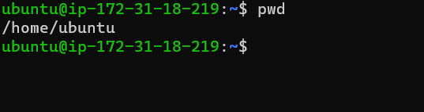

# **Project 1**

### Sudo Command!!!

`sudo apt upgrade`

### pwd command : It is used to find the path of ypur current working directory

`pwd`

### mkdir command: It is used to make or create new directory

`mkdir`

### cd command: It is used when you want to change into a new working directory

`cd`

### ls command: It is used to list files and directories within a system

`ls`

### uname command: It will print detailed information about your Linux system and hardware

`uname -a`, `uname -s`, `uname-n`

### df command: It helps to report the system's disk space usage, shown in percentage and Kilobyte

`df -h`

### apt-get command: its a command line tool for handling Advanced Package Tool (APT) libraries in Linux.

`apt-get`

### du command: It helps to check how much space a file or a directory takes up

`du`

### echo command: Its a built-in utility that displays a line of text or string using the standard output

`echo`

### history command: with history the system will list up to 500 previously executed commands, allowing you to reuse them without re-entering.

`history`

### hostname command: It helps to know the system's hostname.

`hostname`

### htop command: The htop command is an interactive program that monitors system resources and server processes in real time.

`htop`

### man command: It provides a user manual of any commands or utilities you can run in terminal.

`man du`

`man ls`

### ping command: It is used for checking whether a network or a server is reachable.

`ping google.com`

### ps command: The ps command produces a snapshot of all running processes in your system.

`ps`

### rm command: It is used to delete files within a directory.

`rm filename`

`rmdir -p filename`

### top command: It helps to display all the running processes and a dynamic real-time view of the current system.

`top`

### touch command: The touch command allows you to create an empty file.

`touch sqlite_commands.sh`

### useradd command: Meaning more than one person caxn use it simultaneously.

`useradd`

`userdel`

