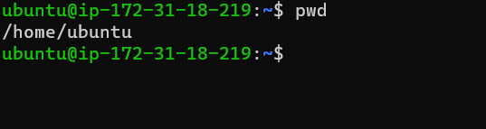

# **Project 1**

### Sudo Command!!!

`sudo apt upgrade`

### pwd command : It is used to find the path of ypur current working directory

`pwd`

### mkdir command: It is used to make or create new directory

`mkdir`

### cd command: It is used when you want to change into a new working directory

`cd`

### ls command: It is used to list files and directories within a system

`ls`

### uname command: It will print detailed information about your Linux system and hardware

`uname -a`, `uname -s`, `uname-n`

### df command: It helps to report the system's disk space usage, shown in percentage and Kilobyte

`df -h`

