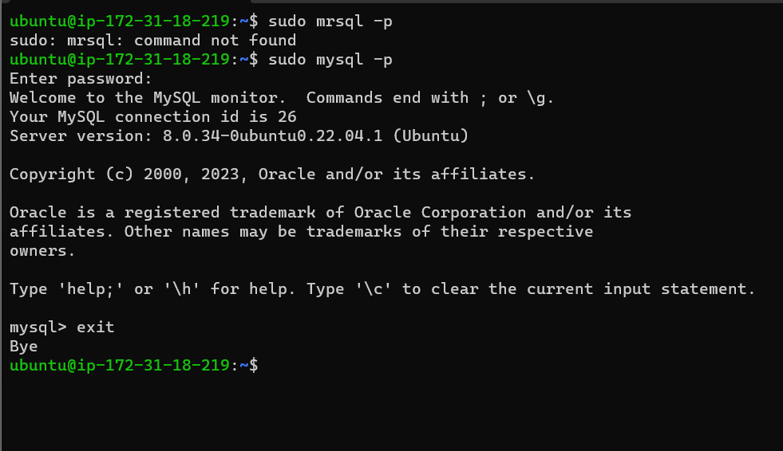

# Installing the Nginx Web Server

# Step 1 - Installing the Nginx Web Server 

## In order to display web pages to our site visitors, we are going to employ Nginx, a high-performance web server.

`$ sudo apt update`

`$ sudo apt install nginx`

## To verify that nginx was successfully installed and is running as a service in Ubuntu, run the following command:

`$ sudo systemctl status nginx`

## Now its time for us to test how our Nginx server can respond to requests from the internet. You can retrieve your public ip address using the folowing command:

`http://<Public-IP-Address>:80`

`curl -s http://169.254.169.254/latest/meta-data/public-ipv4`

## If you see following page, then your web server is now correctly installed and accessible through your firewall.

# Step 2 - Installing MySQL

##  *Now that the web server is up and running, yo need to install a Database Management System to be able to store and manage data for your site in a relational database.*

## Again, use 'apt' to acquire and install this software:

`$ sudo apt install mysql-server`

## When the installation is finished, log in to the MySQL console using:

`$ sudo mysql`

## After login in, its recommended to run a security script that comes pre-installed with MySQL :

`ALTER USER 'root'@'localhost' IDENTIFIED WITH mysql_native_password BY 'PassWord.1';`

## Then the exit the MySQL shell with:

`mysql> exit`

# Step 3 - Installing PHP

## After you have Nginx and MySQL installed, you can now install PHP to process code and generate dynamic content for the web server.

## You will need to install php-fpm and php-mysql. To run these 2 packages at once, run:

`$ sudo apt install php-fpm php-mysql`

# Step 4 - Configuring Nginx to Use PHP Processor.

## Create the root web directory for your_domain as follows:

`$ sudo mkdir /var/www/projectLEMP`

### Next assign ownership:

`$ sudo chown -R $USER:$USER /var/www/projectLEMP`

### Then, open a new configuration file in Nginx using nano:

`$ sudo nano /etc/nginx/sites-available/projectLEMP`

## This will create a new blank file, paste the following configuration:

#/etc/nginx/sites-available/projectLEMP

server {
    listen 80;
    server_name projectLEMP www.projectLEMP;
    root /var/www/projectLEMP;

    index index.html index.htm index.php;

    location / {
        try_files $uri $uri/ =404;
    }

    location ~ \.php$ {
        include snippets/fastcgi-php.conf;
        fastcgi_pass unix:/var/run/php/php8.1-fpm.sock;
     }

    location ~ /\.ht {
        deny all;
    }

}

## Activate your configuration by linking to the config file from Nginx's site enabled directory.

`$ sudo ln -s /etc/nginx/sites-available/projectLEMP /etc/nginx/sites-enabled/`

## Then test the configuration for syntax error by typing :

`$ sudo nginx -t`

## We also need to disable default Nginx host that is currently configured to listen on por 80, for this run :

`sudo unlink /etc/nginx/sites-enabled/default`

### When you are set, reload Nginx to apply the changes:

`$ sudo systemctl reload nginx`

## So now to test that the new server block works as expected, we need to create an index.html file in the projectLEMP web root location:

`sudo echo 'Hello LEMP from hostname' $(curl -s http://169.254.169.254/latest/meta-data/public-hostname) 'with public IP' $(curl -s http://169.254.169.254/latest/meta-data/public-ipv4) > /var/www/projectLEMP/index.html`

## Now go to your browser and refresh, If you see the text from 'echo' command you wrote to index.html file, then it means Nginx site is working as expected. 

# Step 5 - Testing PHP with Nginx

## Your LEMP stack should now be completely set up, you can test it to validate that Nginx can correctly hand .php files off to your PHP processor.

`$ nano /var/www/projectLEMP/info.php`

### paste the following lines into the new file:

`<?php
phpinfo();`

## You can now access this page in your web browser.
## You will see a web page containing detailed information about your server:

# Step 6 - Retrieving data from MySQL database with PHP.

## In this step yoy will create a test database (DB) with simple "To do list" and configure access to it, so the Nginx website should be able to query data from the DB and display it.

## First connect to the MySQL console and create a new database.

`$ sudo mysql`

`mysql> CREATE DATABASE `example_database`;`

`mysql>  CREATE USER 'example_user'@'%' IDENTIFIED WITH mysql_native_password BY 'PassWord.1';`

`mysql> GRANT ALL ON example_database.* TO 'example_user'@'%';`

`mysql> exit`

## You can test if the new user has the proper permissions by logging in to the MySQL console again.

`$ mysql -u example_user -p`

### After loggin in to the MySQL console, confirm thay you have access to the `example_database` database

`mysql> SHOW DATABASES;`

## Next, we will create a test table named todo_list, from the MySQL console, run the following statement:

`CREATE TABLE example_database.todo_list (item_id INT AUTO_INCREMENT,content VARCHAR(255),PRIMARY KEY(item_id));`

## Insert a few rows of content in the test table:

`mysql> INSERT INTO example_database.todo_list (content) VALUES ("My first important item")`

`mysql> INSERT INTO example_database.todo_list (content) VALUES ("My second important item");`

`mysql> INSERT INTO example_database.todo_list (content) VALUES ("My third important item");`

`mysql> INSERT INTO example_database.todo_list (content) VALUES ("My fourth important item");`

### After confirming that you have valid data in your table, you can exit the MySQL console:

`mysql> exit`

### Now you can create a PHP script that will content to MySQL and query for your contet.

`$ nano /var/www/projectLEMP/todo_list.php`

## Copy this content into your `todo_list.php` script:

`<?php
$user = "example_user";
$password = "PassWord.1";
$database = "example_database";
$table = "todo_list";

try {
  $db = new PDO("mysql:host=localhost;dbname=$database", $user, $password);
  echo "<h2>TODO</h2><ol>";
  foreach($db->query("SELECT content FROM $table") as $row) {
    echo "<li>" . $row['content'] . "</li>";
  }
  echo "</ol>";
} catch (PDOException $e) {
    print "Error!: " . $e->getMessage() . " ";
    die();
}`

## You can now access this page in your web browser by visiting the domain name configured for your website, followed by /todo_list.php:

`http://<Public_domain_or_IP>/todo_list.php`

# That means your PHP environment is ready to connect and interact with your MySQL server.

