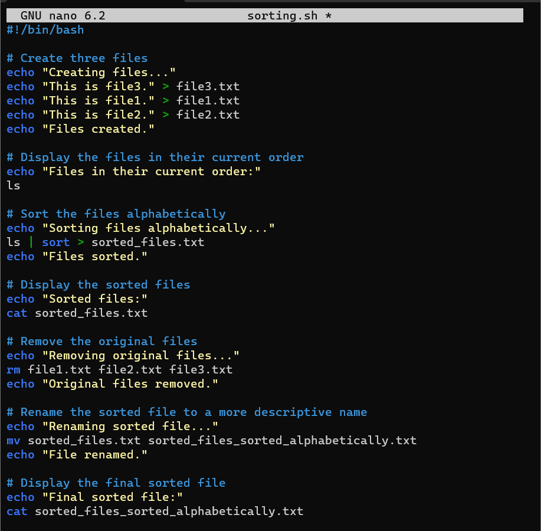
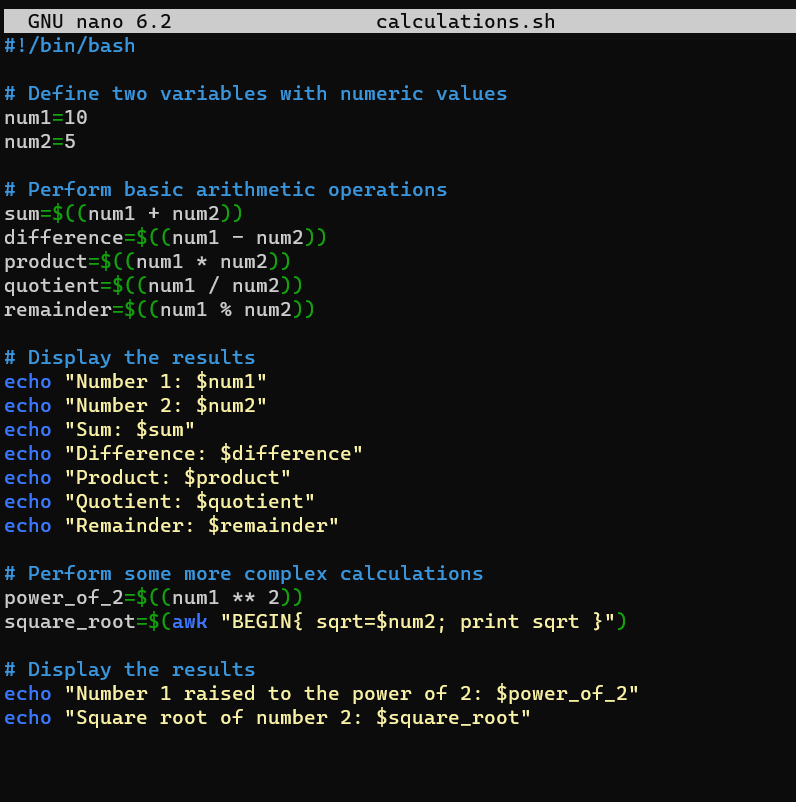

# SHELL SCRIPTING

## Introduction to Shell Scripting and User Input 

### Shell Scripting Syntax Elements; 

### Variables can store data of various types such as numbers, string and arrays. You can assign values to variables using the = operator, and access their values using the variable name preceded by a $ sign.

### Control Flow: Bash provides control flow statements like if-else, for loops, while loops, and case statements to control the flow of execution in your scripts. These statements allow you to make decisions, iterate over lists, and execute different commands based on conditions.

### *Iterating through a list using a foor loop*

### *Using if-else to execute script based on a conditions*

## Lets write our First Shell Script

## Step 1: On your terminal, opean a folder called *shell-scripting* using the command `mkdir shell-scripting`

## Step 2: Create a file called *user-input* using the command `touch user-input.sh`

## Step 3: Inside the file copy and paste the block of code brlow.

#!/bin/bash

### Prompt the user for their name
echo "Enter your name:"
read name

### Display a greeting with the entered name
echo "Hello, $name! Nice to meet you."

## Step 4: Save teh file and run the command that makes the fie executable. `sudo chmod +x user-input.sh`

## Step 6: Run the script using the command `./user-input.sh`

# Directory Manipulation and Navigation

### This script will display the current directory, create a new directory called "my_directory", change to that directory, create two files inside it, list the files, move back one level up, remove the "my_directory" and its contents, and finally list the files in the current directory again.  

# File Operations and Sorting

### The script creates three files (file1.txt, file2.txt, and file3.txt), display the files in their current order, sort them alphabetically, saves the sorted files in sorted_files.txt, displays the sorted files, removes the original files, renames the sorted file to sorted_files_sorted_alphabetically.txt, and finally displays the contents of the final sorted file.

# Working with Numbers and Calculations

## Step 1: On your terminal create a file called *calculations.sh* using the command `touch calculations.sh`

#!/bin/bash

## Define two variables with numeric values
num1=10
num2=5

## Perform basic arithmetic operations
sum=$((num1 + num2))
difference=$((num1 - num2))
product=$((num1 * num2))
quotient=$((num1 / num2))
remainder=$((num1 % num2))

## Display the results
echo "Number 1: $num1"
echo "Number 2: $num2"
echo "Sum: $sum"
echo "Difference: $difference"
echo "Product: $product"
echo "Quotient: $quotient"
echo "Remainder: $remainder"

## Perform some more complex calculations
power_of_2=$((num1 ** 2))
square_root=$(awk "BEGIN{ sqrt=$num2; print sqrt }")

## Display the results
echo "Number 1 raised to the power of 2: $power_of_2"
echo "Square root of number 2: $square_root"

# File Backup and Timestamping

### This shell scripting is focused on file backup and timestamp. The script defines the source directory and backup directory paths.

## Step 1: On the terminal, open a file *backup.sh* using the command `touch backup.sh`

## Step 2: Follow through this commands:

#!/bin/bash

## Define the source directory and backup directory
source_dir="/path/to/source_directory"
backup_dir="/path/to/backup_directory"

## Create a timestamp with the current date and time
timestamp=$(date +"%Y%m%d%H%M%S")

## Create a backup directory with the timestamp
backup_dir_with_timestamp="$backup_dir/backup_$timestamp"

## Create the backup directory
mkdir -p "$backup_dir_with_timestamp"

## Copy all files from the source directory to the backup directory
cp -r "$source_dir"/* "$backup_dir_with_timestamp"

## Display a message indicating the backup process is complete
echo "Backup completed. Files copied to: $backup_dir_with_timestamp"

